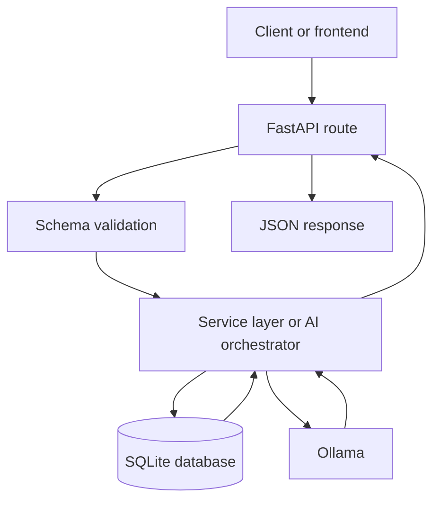
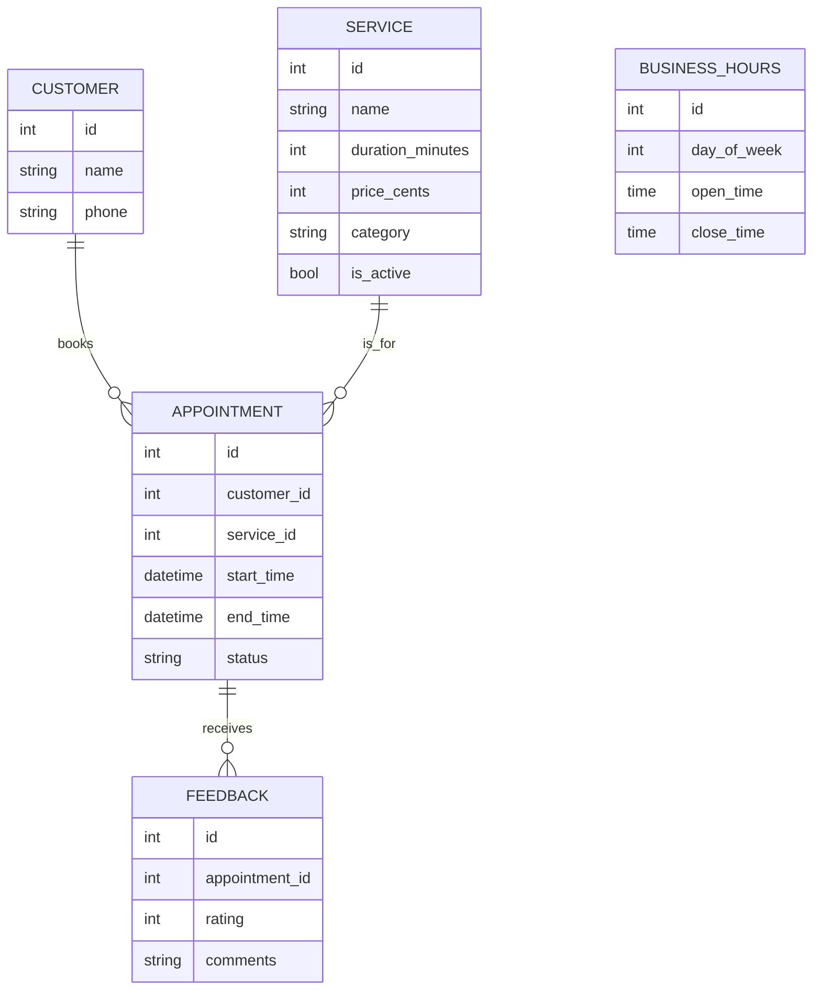
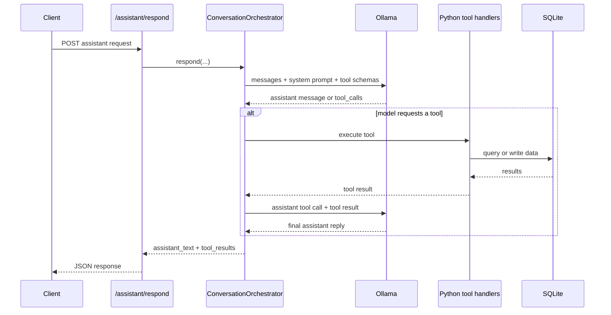

# Backend

This backend is the API and orchestration layer for the salon assistant project.

It currently supports:

- browsing salon services and prices
- checking appointment availability
- creating appointments
- running an AI assistant endpoint backed by Ollama
- returning TwiML for a basic Twilio voice flow
- seeding local demo data for development

It does not fully implement feedback flows yet, and the Twilio call state is still an in-memory MVP.

## What You Are Building

The project is a FastAPI app with a local SQLite database and an Ollama-powered assistant loop.

At a high level:

1. A client calls an HTTP endpoint.
2. The route validates input with Pydantic schemas.
3. The route calls a service or AI orchestrator.
4. Services read or write salon data through SQLAlchemy.
5. The API returns a clean JSON response.

For AI requests:

1. The client sends a caller utterance to `/assistant/respond`.
2. The orchestrator sends the request and tool definitions to Ollama.
3. The model decides whether to call a tool.
4. Python executes the tool against local salon data.
5. The tool result is sent back to Ollama.
6. Ollama returns the final phone-friendly reply.

## Architecture

### Directory Map

- `app/main.py`: FastAPI app creation, router registration, table creation, health check
- `app/api/router.py`: central route registration
- `app/api/routes/`: HTTP endpoints
- `app/ai/prompt.py`: assistant system prompt
- `app/ai/tools.py`: AI tool definitions and tool handlers
- `app/ai/orchestrator.py`: Ollama chat loop and tool-calling orchestration
- `app/api/routes/calls.py`: Twilio voice webhooks and TwiML responses
- `app/services/`: business logic for pricing, booking, and seeding
- `app/models/`: SQLAlchemy ORM models
- `app/schemas/`: request and response schemas
- `app/db.py`: database engine, session factory, and dependency
- `scripts/seed_demo_data.py`: local demo-data bootstrap script
- `tests/`: focused backend tests

### Layer Responsibilities

```text
Client
  -> API routes
  -> Pydantic schemas
  -> services / orchestrator
  -> SQLAlchemy models + database
  -> JSON response
```

### Request Flow Diagram



## Step-By-Step Runtime Walkthrough

### 1. App Startup

When the app starts in [main.py](/Users/ltran/vibe-coding/salon-assistant/backend/app/main.py):

- FastAPI is created
- the shared API router is mounted
- SQLAlchemy tables are created with `Base.metadata.create_all(bind=engine)`
- `/health` becomes available

This means the database schema is created automatically for local development.

### 2. Routes Are Registered

[router.py](/Users/ltran/vibe-coding/salon-assistant/backend/app/api/router.py) mounts these route groups:

- `/assistant`
- `/services`
- `/availability`
- `/appointments`
- `/calls`
- `/feedback`

### 3. Routes Delegate Work

The route files stay thin on purpose.

- `services.py` calls `list_active_services`
- `availability.py` calls `get_available_slots`
- `appointments.py` calls `create_booking`
- `assistant.py` calls the AI orchestrator
- `calls.py` turns Twilio speech webhooks into assistant turns

This keeps business rules out of the HTTP layer.

### 4. Services Apply Salon Rules

The service layer is where the real domain logic lives:

- [pricing.py](/Users/ltran/vibe-coding/salon-assistant/backend/app/services/pricing.py) handles service lookup and matching
- [booking.py](/Users/ltran/vibe-coding/salon-assistant/backend/app/services/booking.py) calculates open slots and prevents overlapping bookings
- [seeding.py](/Users/ltran/vibe-coding/salon-assistant/backend/app/services/seeding.py) inserts demo services and business hours

### 5. Models Persist Data

The SQLAlchemy models define the persistent data:

- `Service`: name, duration, price, category, active flag
- `Customer`: caller identity keyed by phone number
- `Appointment`: booking time window and status
- `BusinessHours`: opening and closing windows per weekday
- `Feedback`: post-appointment feedback record

## Data Model

### Entity Diagram



### Why These Tables Matter

- `services` drives both the public service catalog and AI tool responses
- `business_hours` defines the legal booking window for each day
- `appointments` blocks occupied time ranges
- `customers` lets repeat callers be recognized by phone number
- `feedback` is modeled already, even though the API route is still a placeholder

## API Endpoints

### Available Now

| Method | Path | Purpose |
| --- | --- | --- |
| `GET` | `/health` | Simple app health check |
| `GET` | `/services` | List active salon services |
| `GET` | `/availability` | Return available slots for a service on a date |
| `POST` | `/appointments` | Create a new appointment |
| `POST` | `/assistant/respond` | Run the AI salon assistant |
| `POST` | `/calls/incoming` | Return TwiML to greet and gather caller input |
| `POST` | `/calls/process-speech` | Process Twilio speech results and continue the call |

### Placeholder Endpoints

| Method | Path | Current State |
| --- | --- | --- |
| `POST` | `/feedback` | returns `{"status": "not_implemented"}` |

## AI Assistant Architecture

### Files Involved

- [prompt.py](/Users/ltran/vibe-coding/salon-assistant/backend/app/ai/prompt.py)
- [tools.py](/Users/ltran/vibe-coding/salon-assistant/backend/app/ai/tools.py)
- [orchestrator.py](/Users/ltran/vibe-coding/salon-assistant/backend/app/ai/orchestrator.py)
- [assistant.py](/Users/ltran/vibe-coding/salon-assistant/backend/app/api/routes/assistant.py)

### Assistant Flow Diagram



### Current Tool Set

Defined in [tools.py](/Users/ltran/vibe-coding/salon-assistant/backend/app/ai/tools.py):

- `lookup_service_price`
- `check_availability`
- `create_appointment`

These tools map directly to backend service logic instead of calling the HTTP API again internally.

### Why The Orchestrator Exists

The orchestrator separates model behavior from business logic.

Its job is to:

- build the message list
- attach the system prompt
- expose tool schemas to Ollama
- detect tool calls in model output
- run local Python tools
- feed tool results back into the model
- stop when the model returns a final natural-language reply

That design makes the assistant easier to test because the model client can be faked in unit tests.

## How Booking Logic Works

The important rules live in [booking.py](/Users/ltran/vibe-coding/salon-assistant/backend/app/services/booking.py).

### Availability

`get_available_slots`:

1. loads the requested service
2. loads business hours for the requested weekday
3. converts opening hours into concrete datetimes
4. loads existing booked appointments that overlap the open window
5. walks the day with a cursor
6. returns gaps large enough for the service duration

### Appointment Creation

`create_booking`:

1. validates that the service exists and is active
2. checks that the salon is open that day
3. checks that the requested time is inside business hours
4. checks for overlapping booked appointments
5. finds or creates the customer by phone number
6. writes the appointment and commits it

This means booking protection is enforced in Python before the row is inserted.

## Schemas And Validation

Pydantic schemas define the API contract:

- [service.py](/Users/ltran/vibe-coding/salon-assistant/backend/app/schemas/service.py)
- [availability.py](/Users/ltran/vibe-coding/salon-assistant/backend/app/schemas/availability.py)
- [appointment.py](/Users/ltran/vibe-coding/salon-assistant/backend/app/schemas/appointment.py)
- [assistant.py](/Users/ltran/vibe-coding/salon-assistant/backend/app/schemas/assistant.py)

Examples:

- `AppointmentCreate` validates `customer_name`, `phone`, `service_id`, and `start_time`
- `AssistantRequest` validates `user_utterance`, optional `caller_phone`, and prior conversation history
- `AssistantResponse` returns the final assistant text plus the tools used

## Local Development Setup

### Quick Start

```bash
cd /Users/ltran/vibe-coding/salon-assistant/backend
python3 -m venv .venv
.venv/bin/pip install -r requirements.txt
cp .env.example .env
.venv/bin/python scripts/seed_demo_data.py
ollama pull qwen3
ollama serve
.venv/bin/uvicorn app.main:app --reload
```

### Environment Variables

Create `.env` from [.env.example](/Users/ltran/vibe-coding/salon-assistant/backend/.env.example).

| Variable | Default | Purpose |
| --- | --- | --- |
| `DATABASE_URL` | `sqlite:///./salon_assistant.db` | Local SQLite database |
| `OLLAMA_BASE_URL` | `http://localhost:11434/api` | Ollama API base URL |
| `OLLAMA_MODEL` | `qwen3` | Model name used by the assistant |

### Seeded Demo Data

The seed script currently writes:

- 6 demo services
- Monday through Saturday business hours

That gives the assistant something real to reason over during local development.

## Step-By-Step Learning Path

If you want to learn this codebase in a good order, follow this sequence:

1. Start with [main.py](/Users/ltran/vibe-coding/salon-assistant/backend/app/main.py) to see how the app boots.
2. Read [router.py](/Users/ltran/vibe-coding/salon-assistant/backend/app/api/router.py) to see the public surface area.
3. Read one simple route first: [services.py](/Users/ltran/vibe-coding/salon-assistant/backend/app/api/routes/services.py).
4. Then read [pricing.py](/Users/ltran/vibe-coding/salon-assistant/backend/app/services/pricing.py) to see route-to-service delegation.
5. Move to [booking.py](/Users/ltran/vibe-coding/salon-assistant/backend/app/services/booking.py), which contains the most important domain rules.
6. Review the ORM models in `app/models` so the database layer becomes concrete.
7. Read [assistant.py](/Users/ltran/vibe-coding/salon-assistant/backend/app/api/routes/assistant.py).
8. Then read [tools.py](/Users/ltran/vibe-coding/salon-assistant/backend/app/ai/tools.py).
9. Finish with [orchestrator.py](/Users/ltran/vibe-coding/salon-assistant/backend/app/ai/orchestrator.py), because that file ties everything together.

## Example Requests

### List Services

```bash
curl http://127.0.0.1:8000/services
```

### Check Availability

```bash
curl "http://127.0.0.1:8000/availability?service_id=2&requested_date=2026-04-20"
```

### Create Appointment

```bash
curl -X POST http://127.0.0.1:8000/appointments \
  -H "Content-Type: application/json" \
  -d '{
    "customer_name": "Taylor Tran",
    "phone": "5551234567",
    "service_id": 2,
    "start_time": "2026-04-20T10:00:00",
    "notes": "Prefers neutral colors"
  }'
```

### Ask The Assistant

```bash
curl -X POST http://127.0.0.1:8000/assistant/respond \
  -H "Content-Type: application/json" \
  -d '{
    "user_utterance": "How much is a gel manicure?",
    "caller_phone": "5551234567",
    "conversation_history": []
  }'
```

## Tests

The backend has focused tests for:

- core API routes
- booking and tool behavior
- assistant route behavior
- orchestrator tool-calling loop
- demo data seeding

Run them with:

```bash
backend/.venv/bin/python -m pytest backend/tests
```

## Current Status

Implemented:

- service catalog API
- availability API
- appointment creation API
- demo data seeding
- Ollama-based AI assistant with tool calling
- backend tests around the main flows

Still to do:

- incoming call workflow
- feedback submission workflow
- cancellation and rescheduling flows
- richer production error handling
- frontend or telephony integration beyond placeholders
