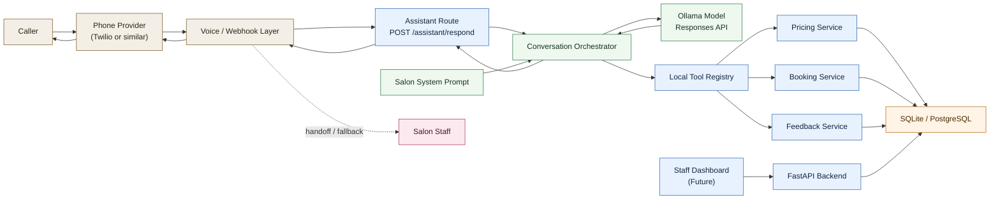

# Architecture Diagram

This diagram shows both the current backend flow and the future phone-call path for the salon assistant.

## Legend

- Beige `external`: outside-facing systems and transport layers such as the caller, telephony provider, and webhook entrypoint
- Blue `backend`: application-owned backend components including routes, tool registry, and business services
- Green `ai`: AI orchestration components including the prompt, orchestrator, and model
- Orange `data`: persistent storage and source-of-truth data systems
- Pink `human`: manual fallback or staff-assisted parts of the workflow

## Reading the Diagram

- `Caller -> Phone Provider -> Voice / Webhook Layer` is the future live-call path.
- `POST /assistant/respond` is the current application entry point for text-driven orchestration.
- `Conversation Orchestrator` sends the caller request, system prompt, and tool definitions to the model.
- The model can call local tools for prices, availability, and booking instead of inventing salon data.
- Business services read and write the database, which remains the source of truth.
- If the assistant cannot safely handle a request, the flow can hand off to salon staff.
